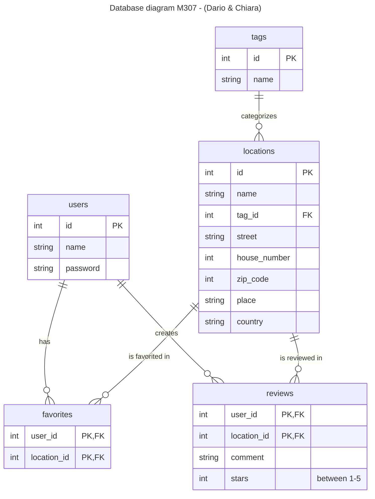

```mermaid
---
title: Database diagram M307 - (Dario & Chiara)
---
erDiagram
    users one to many reviews: creates
    users one to many favorites : has
    locations one to many favorites : "is favorited in"
    locations one to many reviews : "is reviewed in"
    tags one to many locations : categorizes

    users {
        int id PK
        string name
        string password
    }
    reviews {
        int user_id PK, FK
        int location_id PK, FK
        string comment
        int stars "between 1-5"
    }
    favorites {
        int user_id PK, FK
        int location_id PK, FK
    }
    locations {
        int id PK
        string name
        int tag_id FK
        string street
        int house_number
        int zip_code
        string place
        string country
    }
    tags {
        int id PK
        string name
    }
```
