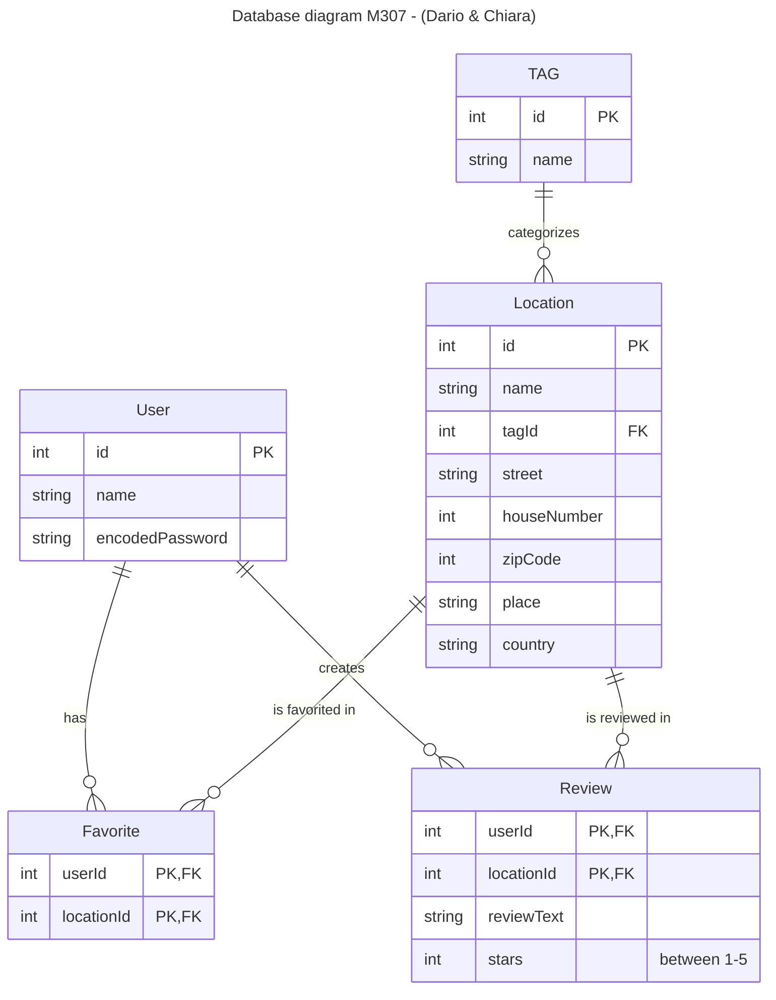

```mermaid 
---
title: Database diagram M307 - (Dario & Chiara)
---
erDiagram
    User one to many Review: creates
    User one to many Favorite : has
    Location one to many Favorite : "is favorited in"
    Location one to many Review : "is reviewed in"
    TAG one to many Location : categorizes

    User {
        int id PK
        string name
        string encodedPassword
    }
    Review {
        int userId PK, FK
        int locationId PK, FK
        string reviewText
        int stars "between 1-5"
    }
    Favorite {
        int userId PK, FK
        int locationId PK, FK
    }
    Location {
        int id PK
        string name
        int tagId FK
        string street
        int houseNumber
        int zipCode
        string place
        string country
    }
    TAG {
        int id PK
        string name
    }
```